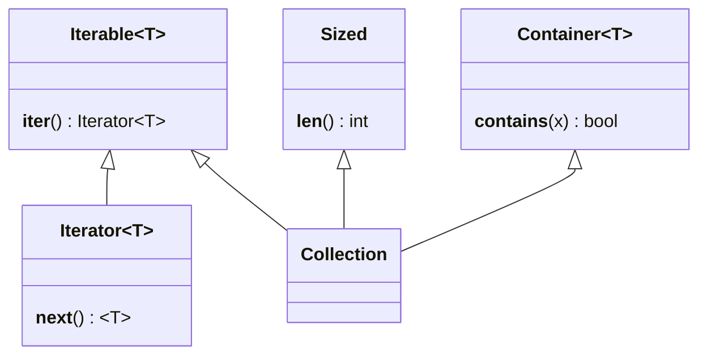
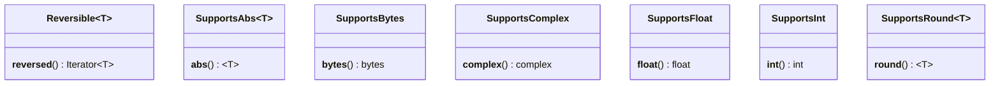
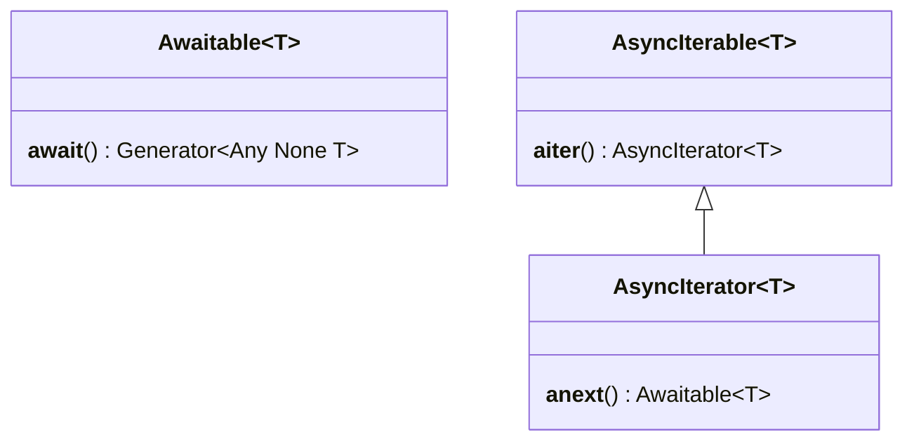
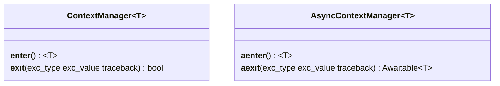
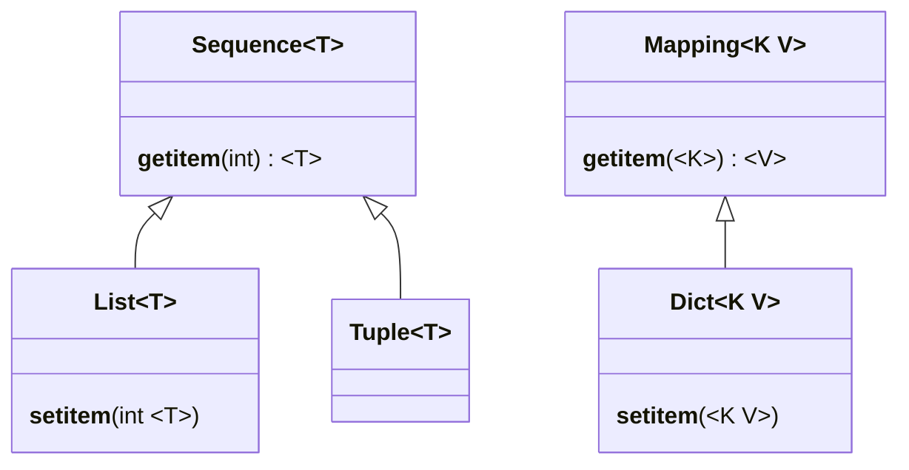

I'm a huge fan of [PEP 484 -- Type Hints](https://www.python.org/dev/peps/pep-0484/).
It adds static typeing to Python, which allows me to avoid stuping mistakes a compiled language usually detects.

My main tool is [mypy](http://mypy-lang.org/) and its [typeshed](https://github.com/python/typeshed), for which I have by now made several [contributions](https://github.com/python/typeshed/pulls?q=is%3Apr+user%3Apmhahn+author%3Apmhahn).

---
# Why

[libvirt-python](https://gitlab.com/libvirt/libvirt-python/-/merge_requests/10/commits)
```python
>>> import libvirt
>>> con = libvirt.open('test:///default')
>>> dom = con.lookupByName("test")
>>> first = dom.checkpointCreateXML("""<domaincheckpoint><name>First</name></domaincheckpoint>""")
>>> second = dom.checkpointCreateXML("""<domaincheckpoint><name>Second</name></domaincheckpoint>""")
>>> child, = first.listAllChildren()
>>> second.domain()
<libvirt.virDomain object at 0x7f828d777b80>
         ^^^^^^^^^
>>> child.domain()
<libvirt.virDomainCheckpoint object at 0x7f828d8160a0>
         ^^^^^^^^^^^^^^^^^^^
```

---
# Example

* [from typing import ...](https://docs.python.org/3/library/typing.html)

## Dynamic typed
```python
def concat(a, b):
  return "a=" + a + " b=" + b

concat("text", 1)
# TypeError: can only concatenate str (not "int") to str
```

## Static typed
### Python 3.5
```python
def concat(a: str, b: str) -> str: ...
```

### Python 2.7
```python
def concat(a, b):  # type: (str, str) -> str
```

---
# Install

```bash
python3 -m pip install mypy
```

## Running:

```bash
mypy program3.py
mypy --py2 programm2.py
```

## Custom Typeshed

```bash
git clone https://github.com/python/typeshed
git clone https://github.com/univention/typeshed.git
mypy --custom-typeshed-dir "$HOME/REPOS/PYTHON/typeshed" "$@"
```

---
# Python 2

* Use `  # type: `
* `str` (bytes) is promoted to `unicode`

## Python 3.6

* New [syntax for variable declarations](https://www.python.org/dev/peps/pep-0526):
  `var: List[int] = []`
* [ContextManager](https://docs.python.org/3/library/typing.html#typing.ContextManager)

## Python 3.7

* `from __future__ import annotations`

## Python 3.8

* [Literal](https://docs.python.org/3/library/typing.html#typing.Literal) moved to `typing`
* [TypedDict](https://docs.python.org/3/library/typing.html#typing.TypedDict) moved to `typing`

---
# Protocols

But I also ways forget, which *Protocol* I need for wich type. So here'e a short presentation.

# [Iteration](https://mypy.readthedocs.io/en/stable/protocols.html#iteration-protocols) and [Collection](https://mypy.readthedocs.io/en/stable/protocols.html#collection-protocols)



# [One-off protocols](https://mypy.readthedocs.io/en/stable/protocols.html#one-off-protocols)



# [Async protocols](https://mypy.readthedocs.io/en/stable/protocols.html#async-protocols)



# [Context manager protocols](https://mypy.readthedocs.io/en/stable/protocols.html#context-manager-protocols)



# [Built-in types](https://mypy.readthedocs.io/en/latest/builtin_types.html)
* int
* float
* bool
* str
* bytes
* object

* `Any`


<!--more-->

---
# Iterable

Iterable is iterable **once**:

```python
some_sequence = [1, 2, 3]
some_iter = iter(some_sequence)
for val in some_iter:
    print(val)
for val in some_iter:
    print(val)
```

---
# Advanced usages

* Daemon mode `dmypy run -- …`
* `subgen`
* `# type: ignore`
* `assert var is not None`
* `if isinstance(var, union_sub_type):`
* `reveal_type(var)`
* `"FutureType"` or `# type: FutureType`

---
# In-/Co-/Contra-Variant

```python
class A: ...
class B(A): ...

old = [A(), A()]  # List[A]
new = [B(), B()]  # List[B]
old = new  # NOT invariant
```

---
# Misc


