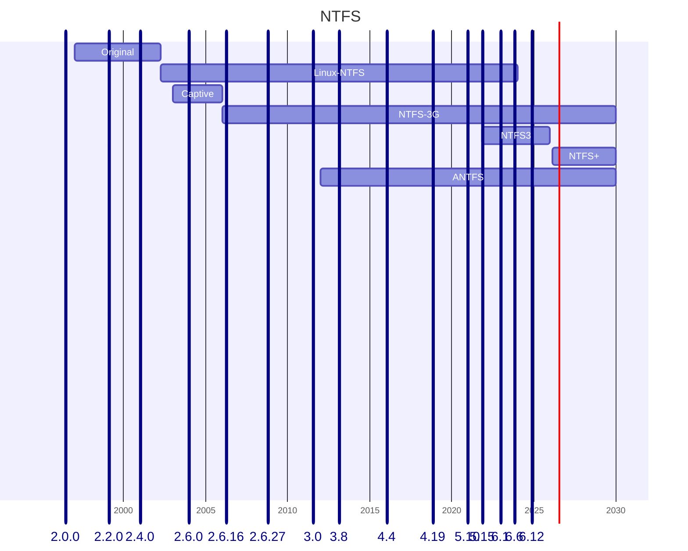

The _Windows New Technology File System_ (NTFS) has a long history with Linux:

| Driver          | Type   | Based on   | Kernel | Period    | Read-write |
|-----------------|--------|------------|--------|-----------|------------|
| Original        | Kernel | Scratch    | 2.1.74 | 1995-2001 | Read-only  |
| [Linux-NTFS][1] | Kernel | Scratch    | 2.5.11 | 2002-2024 | Read-only  |
| [Captive][2]    | FUSE   | `ntfs.sys` |        | 2003-2006 | Read-write |
| [NTFS-3G][3]    | FUSE   | Linux-NTFS | 3.18   | 2006-     | Read-write |
| [NTFS3][4]      | Kernel | Paragon    | 5.15   | 2021-2026 | Read-write |
| [NTFS Plus][5]  | Kernel | Linux-NTFS | 7.0?   | 2026-     | Read-write |
| AVM NTFS        | Kernel | NTFS-3G    |        | 2012-     | Read-write |

[1]: https://flatcap.github.io/linux-ntfs/misc.html
[2]: https://en.wikipedia.org/wiki/Captive_NTFS
[3]: https://en.wikipedia.org/wiki/NTFS-3G
[4]: https://www.kernel.org/doc/html/latest/filesystems/ntfs3.html
[5]: https://git.kernel.org/pub/scm/linux/kernel/git/linkinjeon/ntfs.git/log/?h=ntfs-next&ref=itsfoss.com

<!--more-->

1. The _Original_ implementation was from Martin von Löwis.
2. Anton Altaparmakov created the 2nd implementation _Linux-NTFS_ from scratch, which replaced the original implementation.
3. _Captive_ was the first user-space based implementation, which used the original Windows driver `ntfs.sys` from Microsoft and run it under Wine.
4. _NTFS-3G_ also runs in user-space and uses FUSE to talk to the kernel.
5. Paragaon donated an open-source version of if proprietary _NTFS3_ to the Linux kernel. It was the first read-write implementation in the kernel, but is less documented.
6. _NTFS Plus_ is based on the older _Linux-NTFS_ implementation, adds read-write support and updates the implementation to use modern Linux APIs. It is scheduled to replace _NTFS3_ again.
7. AVM – now FRITZ! Technology – ported the _NTFS-3G_ to kernel space and is used in FritzOS only.

## Links
- Wikipedia: [Linux Kernel version history](https://en.wikipedia.org/wiki/Linux_kernel_version_history)

<!-- <https://www.cyberark.com/resources/threat-research-blog/the-linux-kernel-and-the-cursed-driver -->
