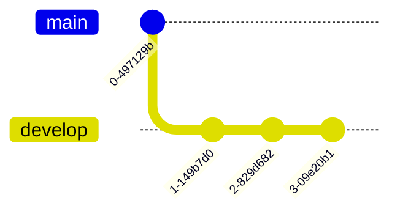

Linters run as part of GitLab Continuous Integration pipelines to guarantee code quality.
A Merge Request based workflow will start from a branch `main` being currently at some commit `start`.
You normally fork a branch `develop` from that branch `base` and will create several commits `c1`, `c2`, …, `cN`.
When you [push that branch and create a Merge Request](), a pipeline may start and  will run several jobs.

<!--more-->



There are different ways to run your linters:
1.  You may run your linter like `ruff` just on the **last** commit `cN`, which then just checks the state after applying all commits `c1…cN` on top of `branch`.
    This will not only check and find issues introduced by your changes, but will also check all other files and find issues there.
2.  You may want to build the **diff** from `main` to `develop` and run your linter on that.
    That way you check you *effective change*.
3.  You may also want to run the linter on **each** commit.
    This is important if you later want to use `git bisect` to find regressions.

Depending on which strategy you want to use, you have to configure your jobs differently in GitLab.

## Check state after last commit

This is the easies one as GitLab already checks out the branch for us.
You can optimize that by using [Shallow cloning](https://docs.gitlab.com/ci/runners/configure_runners/#shallow-cloning) to only clone the last commit.
By default GitLab clones the last 20 commits, which might pull too much data.

```yaml
run linter:
  variables:
    GIT_DEPTH: 1
  script:
    - ruff check
```

You can reduce the clone depth down to 1 to improve that further, but that may introduce problems later.
[Shallow cloning](https://docs.gitlab.com/ci/runners/configure_runners/#shallow-cloning) has more information on that and contains a warning, that this might not work with GitLab in some cases:
GitLab-Runner clones by `ref`, but might then pick a previous commit for the job to run on.
With `--depth=1` that might not work as there will be no previous commits to run on.

Disclaimer: I have not checked that behavior myself and doubt, that this is actually correct.

## Check diff from fork-point to last commit

To build the diff you must also fetch the _fork-point_ in addition to the branch `develop`.
This is not equivalent to `main` as other commits might have been pushed there.
Luckily GitLab already tells us the _fork-point_ commit:
The [pre-defined variable](https://docs.gitlab.com/ci/variables/predefined_variables/#predefined-variables-for-merge-request-pipelines) `CI_MERGE_REQUEST_DIFF_BASE_SHA` contains the SHA1 of the merge request diff.
We have to fetch this either manually by running `git fetch` ourself — or we can add it to [`GIT_FETCH_EXTRA_FLAGS`](https://docs.gitlab.com/ci/runners/configure_runners/#git-fetch-extra-flags).
That has the benefit that the GitLab-Runner will fetch the commit for us when it fetches `develop`.
This is more efficient and also uses the credentials of the Runner.

```yaml
run linter:
  variables:
    GIT_DEPTH: 1
    GIT_FETCH_EXTRA_FLAGS: "--prune --quiet --no-tags $CI_MERGE_REQUEST_DIFF_BASE_SHA"
  script:
    - git diff "${CI_MERGE_REQUEST_DIFF_BASE_SHA}..HEAD" | checkpatch -
```

Correction (2026-04-17):
Actually this does not work as the GitLab-Runner uses `git init` followed by `git fetch` by default.
For the later GitLab will add the refspecs `+refs/heads/*:refs/origin/heads/*` and `+refs/tags/*:refs/tags/*` to `git fetch`, which will fetch all heads and tags.
Neither the `--no-tags` disables fetching the tags not is the `$CI_MERGE_REQUEST_DIFF_BASE_SHA` needed.

Instead of using `init+ferch`, `git clone` can be used if
- the feature-flag [`FF_USE_GIT_NATIVE_CLONE`](https://docs.gitlab.com/runner/configuration/feature-flags/) is enabled.
- the version of `git` is at least `2.49` released 2025-03-14 supporting `--branch` and the newer `--revision`.
- `GIT_STRATEGY=clone` is set as a job variable.

`GIT_DEPTH` can be used to limit the `git clone --depth`, which then also adds `--single-branch`.
That option and other options like `--no-tags` can be passed via `GIT_CLONE_EXTRA_FLAGS`.

The drawback is, that `git clone` can only clone a single branch or revision.
Fetching `CI_MERGE_REQUEST_DIFF_BASE_SHA` thus requires a manual call of `git fetch`.

```yaml
run linter:
  variables:
    GIT_STRATEGY: "clone"
    GIT_DEPTH: 1
    GIT_CLONE_EXTRA_FLAGS: "--no-tags --single-branch"
  script:
    - git fetch origin "$CI_MERGE_REQUEST_DIFF_BASE_SHA"
    - git diff "${CI_MERGE_REQUEST_DIFF_BASE_SHA}..HEAD" | checkpatch -
```

## Check all commits from fork-point to last commit

To check all commits of a MR individually, you have to do more work.
The [`git` protocol](https://git-scm.com/book/en/v2/Git-Internals-Git-Objects) only supports fetching refs by name or tags / commits / trees / blobs by SHA1!
The problem is that you don't know how many commits are between the fork-point and HEAD; you do not know which value to use for `GIT_DEPTH`.
By using `GIT_DEPTH: 0` you tell the GitLab-Runner to **not** do a shallow-clone and to clone all commits reachable from the tip of the branch.
For large repositories with many commits or large blobs that can become very costly.
So reducing the number or type of objects to download can become important.

There are two sub-cases:

### Only check all commit messages

If you only need the commit messages (and not the files itself), you can use [`git clone --filter`](https://git-scm.com/docs/git-rev-list#Documentation/git-rev-list.txt---filterfilter-spec) to limit which type of objects you want to clone initially: commits, trees, blobs.
Missing objects are lazy-fetches, which can result in a dramatic performance issue when your initial clone filters too much!

But there is one caveat and you have to be careful to use the right `git` commands:
If any `git` command requires missing data, `git` will fetch it on demand.
It will connect again to the remote serer and fetch the missing data.
As this will result in (many) network connection with lots of round-trips, this is then slower than to download it at once during the initial `clone`.

Therefore check the commands you run:
- `git format-patch` and `git show` require the associated `tree`s and `blob`s to be present and will trigger delayed fetches.
- `git log --no-patch` does not and works on `commit`s alone.

```yaml
run linter:
  variables:
    GIT_DEPTH: 0
    GIT_FETCH_EXTRA_FLAGS: --prune --quiet --no-tags --filter=object:type=commit
  script:
    - git log --no-patch "${CI_MERGE_REQUEST_DIFF_BASE_SHA}..HEAD" | mrcheck
```

If you also need the latest tree, use `--filter=tree:0` instead.

### Check all individual commits and their trees (WIP)

Similar to above we first fetch only all `commit` objects.
We then let `git` fetch the required `tree` and `blob` objects on demand.

```yaml
run linter:
  variables:
    GIT_DEPTH: 0
    GIT_FETCH_EXTRA_FLAGS: --prune --quiet --no-tags --filter=tree:0
  script:
    - git log --patch "${CI_MERGE_REQUEST_DIFF_BASE_SHA}..HEAD" | checkpatch -
```

The alternative to start first with a limited number of commits and to incrementally deepen that number of commits until the fork-point is reached also works, but requires more work and leads to multiple network round-trips to the repository server.
Which strategy is faster may depend on the history size.

TBC…


